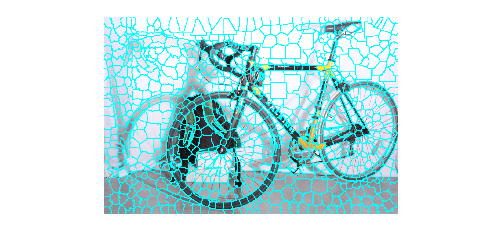
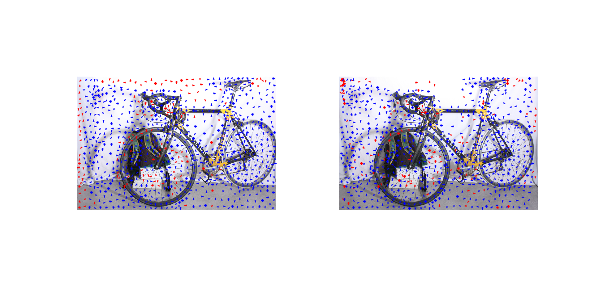
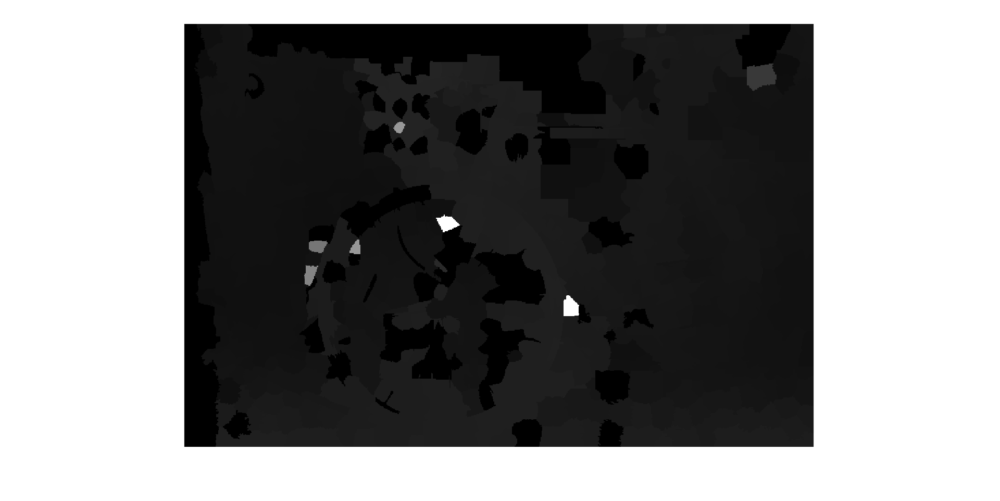
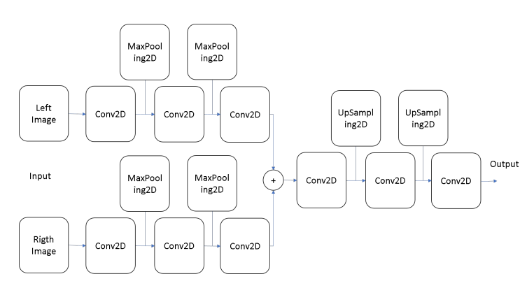

# Disparity estimation with Keras

## Intro

Much research about making depth image with stereo pair has been done.  
However, the traditional method of using epipolar geometry requires a lot of computation to make accurate disparity maps, and the conventional window matching method has a limitation that it does not work well when the image frequency is low.  

fig 1. _Segmentation with color_


fig 2. _Window matching result(Blue: good, Red: bad)


fig 3. _Estimated disparity_


Recently, there have been many attempts to solve the problem of computer vision using deep learning, and depth map estimation has also been attempted to solve using deep learning.

In this simple project, we implement the CNN network using Keras and look for ways to develop it.
```
Disparity map estimation with deep learning in stereo vision

Mendoza Guzm´an V´ıctor Manuel1, Mej´ıa Mu˜noz Jos´e Manuel1, Moreno M´arquez Nayeli Edith1, Rodr´ıguez Azar Paula Ivone1, and Santiago Ram´ırez Everardo1

Universidad Autnoma de Ciudad Jurez @alumnos.uacj.mx
http://www.uacj.mx/Paginas/Default.aspx
```

## Planed
### Implement CNN with disparity estimation
* Implement proposed CNN in paper with Keras

* learn and test 
* Test set is Driving  
https://lmb.informatik.uni-freiburg.de/resources/datasets/SceneFlowDatasets.en.html

### Looking for way to improvement
I planed to use  
* Batch normalization
* Drop out (if need)
* Modify and change CNN model with reference to other articles and ideas
